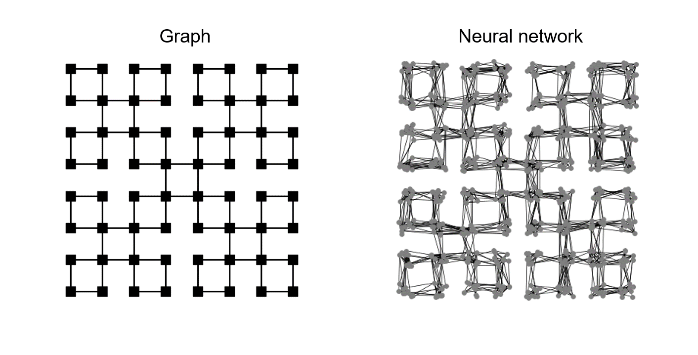

# network-cl

Caluculating the path length and clustering from graph and neural network.

## Installation
1. Clone this repository in command line.
```bash
git clone https://github.com/tkmsumi/network-cl.git
```
2. Go into the repository.
```bash
cd Network-CL
```
3. Use the package manager [pip](https://pip.pypa.io/en/stable/) to install requirements.
```bash
pip install -r requirements.txt
```

## Usage
Use default setting in command line as follows:

```bash
python example.py -c default.conf
```


Another network can be chosen from 4module, 16module, 64module or 64hilbert.
```bash
python example.py -c default.conf --network 64hilbert
```


Also, you can select neuron mode to use neural network.
```bash
python example.py -c default.conf --network 64hilbert --mode neuron
```


In case of neuron mode, please set several parameter such as cell density and connection probability.

See and change **default.conf** or check the help. 
```bash
python example.py --help
```

## Contributing

Pull requests are welcome. For major changes, please open an issue first
to discuss what you would like to change.

Please make sure to update tests as appropriate.

## License
These files are created by tkmsumi and are provided for personal use only.

For any other use, please contact tkmsumi.
